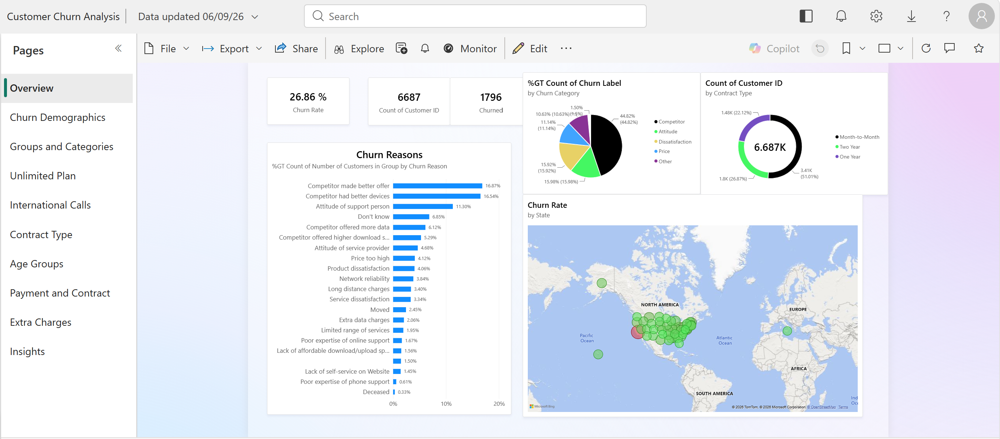
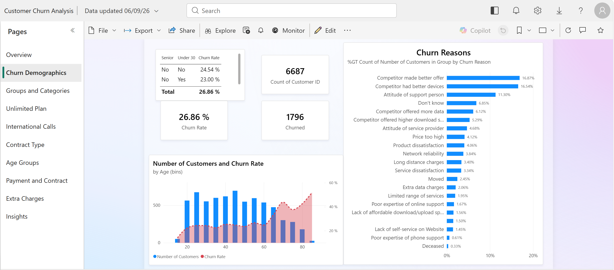
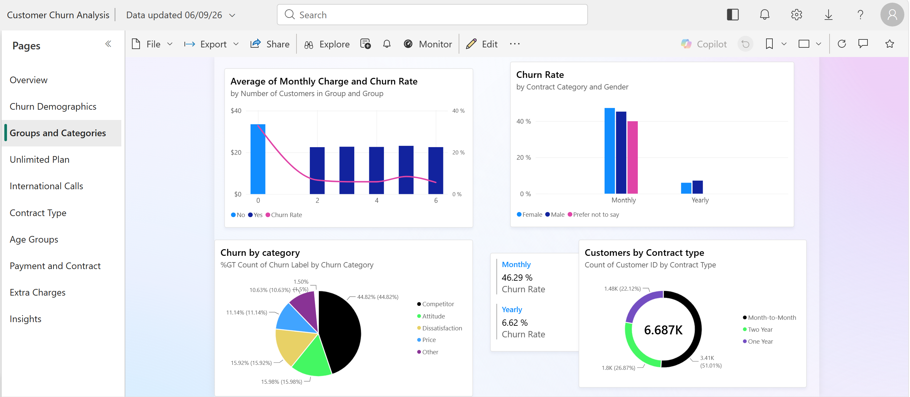
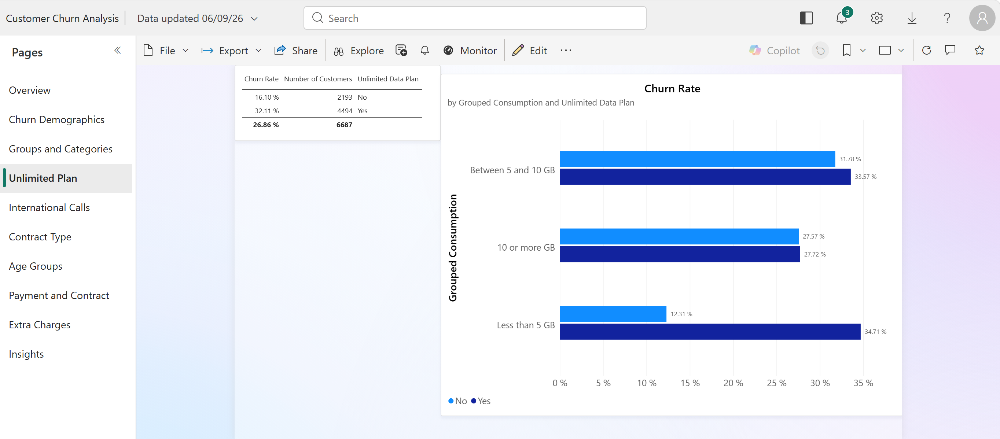
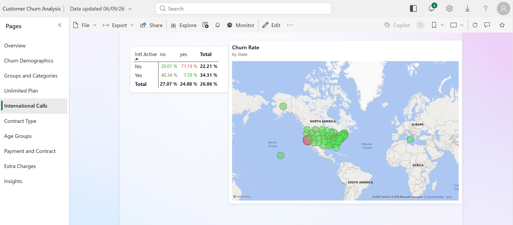
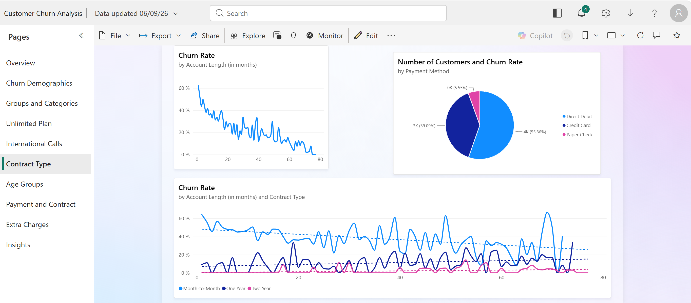
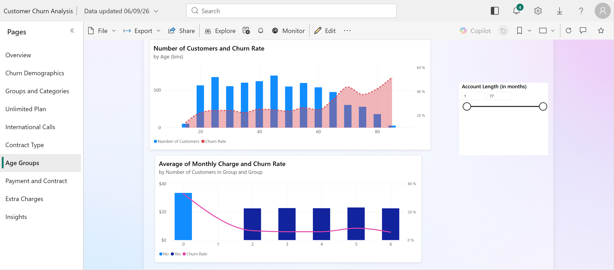
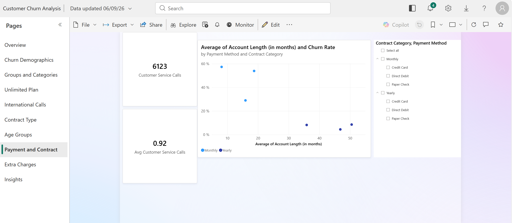
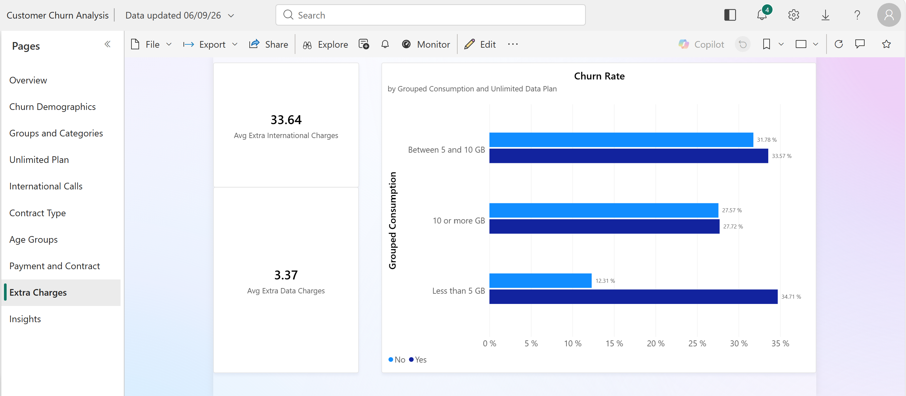
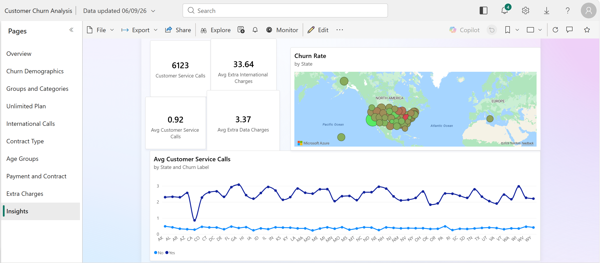

# Customer Churn Analysis – Power BI

## Project Overview

This Power BI project analyzes customer churn for a telecommunications business. The dashboard explores churn from different angles, including customer demographics, contract and payment behavior, data usage, international calls, and customer service interactions.

The goal is to identify patterns behind customer churn and highlight the customer groups and service factors that may require attention.

## Key Results

- **Overall churn rate:** 26.86%
- **Total customers:** 6,687
- **Churned customers:** 1,796
- Customers with **month-to-month contracts** have a much higher churn rate than customers on longer-term contracts.
- **Competitor-related reasons** are the largest contributors to churn, particularly customers reporting that a competitor made a better offer or had better devices.
- Churn varies noticeably across **age groups**, with higher churn among older customers.
- Customers using **less than 5 GB** of data show a clear difference in churn depending on whether they have an unlimited data plan.
- Payment method, contract category, international activity, and customer service usage are also explored as potential churn indicators.

## Dashboard Pages

### Overview

A high-level view of the main KPIs, churn reasons, churn categories, contract types, and geographical distribution.

### Churn Demographics

Examines churn by age and highlights the most common reasons customers leave.

### Groups and Categories

Looks at monthly charges, churn categories, contract categories, gender, and customer distribution by contract type.

### Unlimited Plan

Compares churn rates by grouped data consumption for customers with and without an unlimited data plan.

### International Calls

Analyzes churn in relation to international activity and geographical distribution.

### Contract Type

Explores the relationship between account length, contract type, payment method, and churn.

### Age Groups

Analyzes customer volume and churn rate across age groups, with an account-length filter for further exploration.

### Payment and Contract

Compares average account length and churn rate across payment methods and contract categories, with interactive filtering.

### Extra Charges

Examines extra international and data charges and their relationship with churn.

### Insights

Combines customer service activity and geographical analysis to identify additional churn patterns.

## Tools & Skills

- Microsoft Power BI
- DAX
- Data modeling
- Data visualization
- Interactive filters and cross-highlighting
- KPI design
- Exploratory data analysis
- Customer churn analysis

## Interactivity

The report includes interactive filters and visual interactions that allow users to explore churn patterns by customer characteristics, contract details, payment methods, usage behavior, and other dimensions.

## Project Files

- `Customer Churn Analysis.pbix` – Power BI report
- `screenshots/` – Dashboard screenshots

## How to View

Download the `.pbix` file and open it with Microsoft Power BI Desktop to explore the full interactive report.
